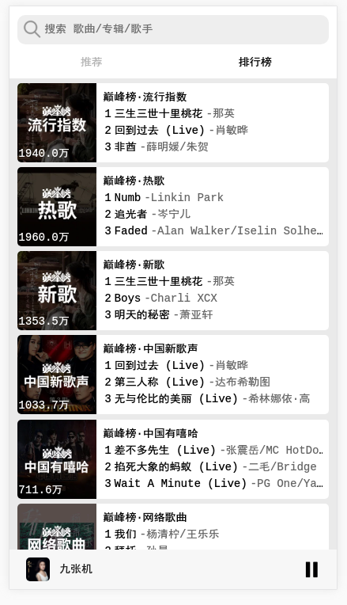
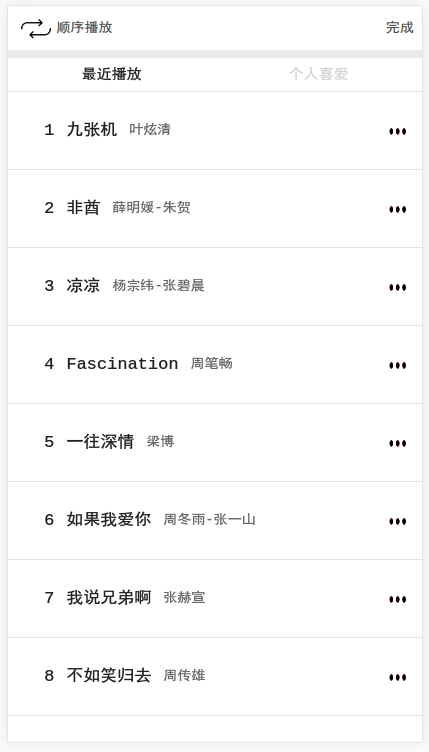

# Web Music 应用

## 运行
```
npm install
// 开发时
npm run dev
// 打包时
npm run build
```

## 概述
这是模仿QQ音乐实现的web版音乐播放器，后台调用的是qq音乐的API。

项目是我学习gulp+webpack+vue时的一次试验，所以写的不好还请不要见笑～～

项目是使用`Vue+webpack+gulp`实现的音乐播放器，其中我用了`webpack+gulp`搭建了一个简易版的脚手架，该脚手架在项目启动时，能自动启动浏览器，加载编译好的项目文件，同时也具备热加载功能和打包功能。

打包后的代码放在`release`文件夹下，可直接双击打开`index.html`运行程序

由于项目是采用APP的界面实现的，所以建议用浏览器的手机版模式来打开。且目前还未有处理断网的情况，APP的正常运行目前是以网络正常为前提的。

## 功能描述
目前，只实现了五个页面，有两个页面，由于API不可知，暂时还未实现。

项目目前具备浏览歌曲、选择播放歌曲、暂停播放、歌曲进度调整、歌单显示、歌曲的增删、数据本地持久化等核心功能。

下面贴上页面：
<div>
    <figure style="display: inline-block; text-align: center">
        
    </figure>
    <figure style="display: inline-block; text-align: center">
        
    </figure>
    <figure style="display: inline-block; text-align: center">
        
    </figure>
    <figure style="display: inline-block; text-align: center">
        
    </figure>
    <figure style="display: inline-block; text-align: center">
        
    </figure>
</div>
